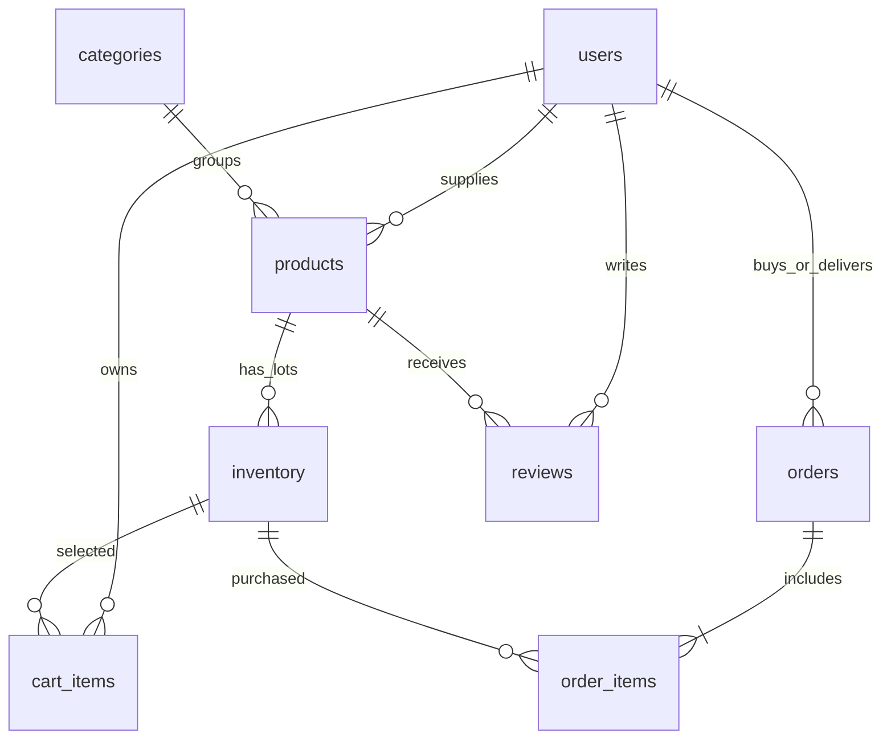
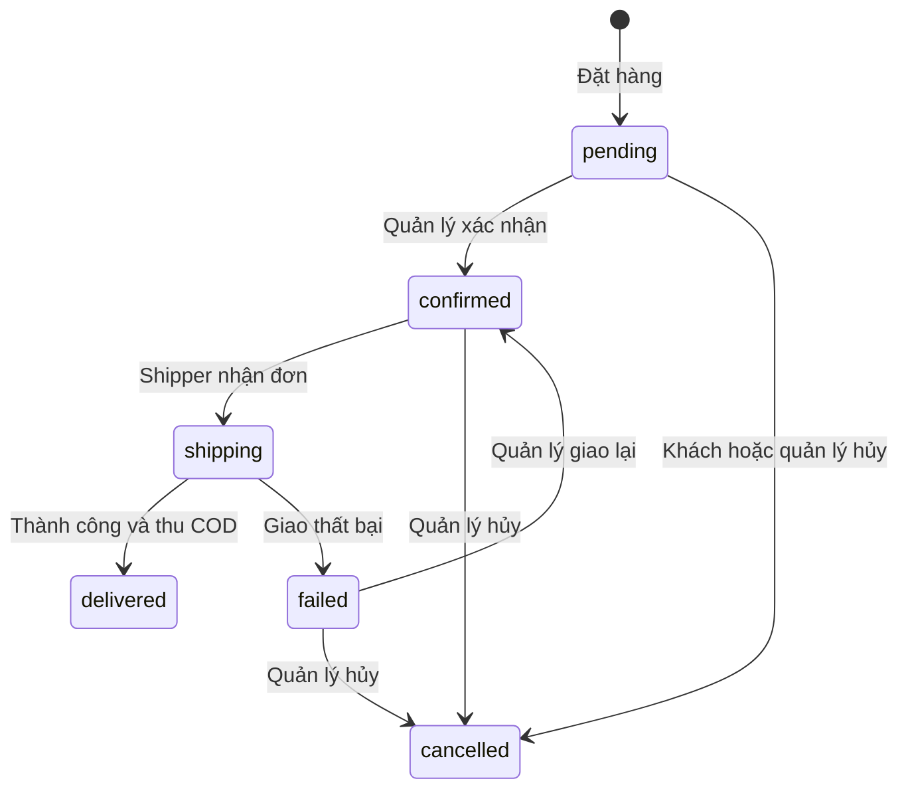

# Cận — Ứng dụng bán hàng cận hạn sử dụng

Bản MVP full-stack chạy được, viết bằng React + Vite, Node.js + Express, **chỉ dùng SQLite**. Giao diện tiếng Việt, không có icon, SVG, emoji hoặc thư viện icon. Minh họa bao bì được dựng bằng chữ và CSS; không phải ảnh thật của sản phẩm. Font được đóng gói cùng ứng dụng, không cần gọi Google Fonts khi chạy.

## 1. Database schema trước tiên

Toàn bộ câu lệnh `CREATE TABLE`, `CHECK`, khóa ngoại và index nằm trong **[server/schema.sql](server/schema.sql)**. SQLite được mở với `foreign_keys = ON`, WAL và `busy_timeout = 5000`.

| Bảng          | Nghiệp vụ                                                                                   |
| ------------- | ------------------------------------------------------------------------------------------- |
| `users`       | Tài khoản, mật khẩu đã hash, một trong 5 vai trò, trạng thái hoạt động                      |
| `sessions`    | Hash token phiên đăng nhập, người dùng, thời hạn phiên                                      |
| `categories`  | Danh mục sản phẩm                                                                           |
| `products`    | Thông tin sản phẩm, danh mục, nhà cung cấp, trạng thái bán                                  |
| `inventory`   | Lô hàng: mã lô, **`expiry_date`**, giá gốc, tồn kho khả dụng                                |
| `cart_items`  | Giỏ theo khách hàng và lô; mỗi lô 1–99 đơn vị                                               |
| `orders`      | Người mua, người giao, thông tin nhận hàng, trạng thái, COD, tổng tiền, khóa chống đặt lặp  |
| `order_items` | Bản chụp tên hàng, nhà cung cấp, hạn dùng, giá gốc, giá bán, mức giảm, số lượng tại lúc đặt |
| `reviews`     | Người đã nhận hàng đánh giá; chỉ hiển thị sau kiểm duyệt                                    |
| `settings`    | Phí giao hàng, ngưỡng miễn phí, các mốc giảm giá                                            |
| `audit_logs`  | Dấu vết đặt đơn, thay đổi kho, tài khoản, cấu hình và trạng thái                            |

Quan hệ chính:



Thiết kế theo lô thay vì gắn một hạn duy nhất trên sản phẩm: cùng một loại sữa có thể có lô còn 3 ngày và lô còn 12 ngày, mỗi lô có tồn kho, giá giảm riêng. Toàn bộ tiền là **số nguyên VND**. Ngày hạn lưu `YYYY-MM-DD`; thời điểm giao dịch lưu UTC ISO 8601.

Ví dụ phần quan trọng của schema (file SQL có đầy đủ các bảng):

```sql
CREATE TABLE IF NOT EXISTS inventory (
  id INTEGER PRIMARY KEY,
  product_id INTEGER NOT NULL REFERENCES products(id),
  lot_code TEXT NOT NULL UNIQUE,
  expiry_date TEXT NOT NULL CHECK (
    length(expiry_date)=10 AND
    expiry_date GLOB '[0-9][0-9][0-9][0-9]-[0-9][0-9]-[0-9][0-9]'
  ),
  original_price INTEGER NOT NULL CHECK (original_price > 0),
  stock INTEGER NOT NULL DEFAULT 0 CHECK (stock >= 0),
  updated_at TEXT NOT NULL DEFAULT (strftime('%Y-%m-%dT%H:%M:%fZ','now'))
);
```

API còn xác thực ngày lịch thực tế, nên `2026-02-31` bị từ chối. Không sửa hạn của lô đã có đơn để tránh làm sai lịch sử; dùng thao tác **Thêm lô** khi nhập đợt hàng mới. Lô chưa phát sinh đơn cho phép Manager, Admin hoặc Vendor sở hữu cập nhật hạn trực tiếp.

## 2. Cấu trúc thư mục

```text
.
├── server/
│   ├── schema.sql          # Toàn bộ SQLite DDL
│   ├── db.js               # Khởi tạo database, WAL, thiết lập mặc định
│   ├── env.js              # Đọc .env bằng Node
│   ├── auth.js             # scrypt, session cookie, middleware RBAC
│   ├── pricing.js          # Ngày tại Việt Nam và giá theo hạn
│   ├── app.js              # API và giao dịch nghiệp vụ
│   ├── seed.js             # Tạo dữ liệu demo, không ghi đè DB có sẵn
│   └── index.js            # Chạy API và phục vụ frontend build
├── src/
│   ├── main.jsx            # React entry point
│   ├── App.jsx             # Cửa hàng, chi tiết, giỏ, checkout, lịch sử
│   ├── Dashboard.jsx       # Các trang theo vai trò
│   ├── api.js              # HTTP client, định dạng tiền/ngày
│   └── styles.css          # Responsive, typography, minh họa CSS
├── tests/
│   └── business.test.js    # Kiểm thử API và nghiệp vụ bằng SQLite in-memory
├── data/market.sqlite      # Sinh khi chạy; không đưa vào Git
├── dist/                   # Frontend build; sinh bằng npm run build
├── .env.example
├── .gitignore
├── index.html
├── package.json
├── package-lock.json
├── vite.config.js
└── README.md
```

## 3. Chạy ứng dụng

Yêu cầu Node.js **20.12 trở lên**; đã kiểm tra với Node 20.18.2 trên Windows. Chạy tại thư mục dự án:

```powershell
npm ci
npm run seed
npm run build
npm start
```

Mở **http://127.0.0.1:3001**. `npm run seed` tạo 8 sản phẩm có hạn tương đối so với ngày chạy seed. Nếu DB đã có người dùng, lệnh sẽ dừng mà không thay dữ liệu.

Chế độ phát triển:

```powershell
npm run dev
```

Frontend: `http://127.0.0.1:5173`; API: `http://127.0.0.1:3001`. Vite proxy `/api` nên không cần mở CORS. Khi sửa cổng API, sửa cả proxy trong `vite.config.js`.

Tùy chọn: sao chép `.env.example` thành `.env`. Server và seed tự đọc file này. `APP_ORIGIN` là origin frontend được phép gửi mutation; mặc định phục vụ cùng nguồn cũng được chấp nhận. Chỉ bật `NODE_ENV=production` khi phục vụ qua HTTPS, vì cookie sẽ có `Secure`. Host mặc định chỉ bind loopback.

### Tài khoản demo

Mật khẩu chung: **`CanDate2026!`**. Chỉ dùng cho demo cục bộ.

| Vai trò                              | Email                |
| ------------------------------------ | -------------------- |
| Customer                             | `customer@can.local` |
| Admin                                | `admin@can.local`    |
| Manager                              | `manager@can.local`  |
| Vendor                               | `vendor@can.local`   |
| Vendor thứ hai để kiểm tra phân tách | `vendor2@can.local`  |
| Shipper                              | `shipper@can.local`  |

Không chạy seed demo trên hệ thống vận hành thật. Tài khoản đăng ký công khai luôn là Customer; Admin cấp vai trò khác tại trang Tài khoản.

## 4. RBAC và giao diện tương ứng

| Vai trò  | Quyền backend và trang frontend                                                                                               |
| -------- | ----------------------------------------------------------------------------------------------------------------------------- |
| Admin    | Toàn bộ quản lý kho/danh mục/đơn/kiểm duyệt; quản lý tài khoản, khóa tài khoản, cấu hình giá/phí, doanh thu toàn sàn, nhật ký |
| Manager  | Kho hàng, cập nhật hạn và tồn kho, tạo lô; danh mục; xác nhận/hủy/giao lại đơn; duyệt/ẩn đánh giá                             |
| Customer | Đăng ký/đăng nhập, tìm kiếm và lọc hàng, giỏ hàng, checkout COD, lịch sử và hủy đơn đang chờ, đánh giá hàng đã nhận           |
| Vendor   | Tạo sản phẩm/lô, sửa và ngừng bán hàng của mình; xem dòng hàng ký gửi và doanh thu của mình                                   |
| Shipper  | Nhìn đơn đã xác nhận chưa được nhận và đơn của mình; nhận đơn, báo thành công/thất bại                                        |

Backend kiểm tra **vai trò + quyền sở hữu**, không chỉ ẩn nút ở frontend. Vendor không nhận địa chỉ/số điện thoại khách qua API đơn hàng. Shipper chỉ hoàn tất đơn mình đã nhận. Admin không tự hạ quyền hoặc khóa tài khoản đang dùng. Khóa hoặc đổi vai trò thu hồi các phiên đăng nhập cũ.

Trạng thái kho được kiểm tra lại ở backend. Đổi tồn kho là đổi số **khả dụng còn lại**, không phải tổng cả hàng đã đặt. Ngừng bán một sản phẩm áp dụng cho tất cả lô của sản phẩm đó.

## 5. API endpoints cốt lõi

Tất cả endpoint bắt đầu bằng `/api`. Request thay đổi dữ liệu dùng `Content-Type: application/json`. Cookie phiên được browser gửi tự động; frontend không lưu token trong localStorage.

| Method       | Endpoint                                 | Quyền                          | Kết quả                                            |
| ------------ | ---------------------------------------- | ------------------------------ | -------------------------------------------------- |
| POST         | `/auth/register`                         | Công khai                      | Tạo Customer và đăng nhập                          |
| POST         | `/auth/login`                            | Công khai                      | Tạo cookie phiên HttpOnly                          |
| POST         | `/auth/logout`                           | Mọi người                      | Xóa phiên hiện tại                                 |
| GET          | `/auth/me`                               | Mọi người                      | Người dùng hoặc `null`                             |
| GET          | `/categories`                            | Công khai                      | Danh mục                                           |
| POST / PATCH | `/categories`, `/categories/:id`         | Admin, Manager                 | Tạo/sửa danh mục                                   |
| GET          | `/products`                              | Công khai                      | Tìm kiếm/phân trang các lô còn bán                 |
| GET          | `/products/:id`                          | Công khai                      | Chi tiết lô và đánh giá đã duyệt                   |
| GET          | `/settings`                              | Công khai                      | Mốc giảm và phí giao hàng                          |
| GET          | `/cart`                                  | Customer                       | Giỏ theo giá hiện tại, tiết kiệm, phí, tổng        |
| PUT          | `/cart/:id`                              | Customer                       | Đặt số lượng tuyệt đối; 0 là bỏ khỏi giỏ           |
| POST         | `/cart/merge`                            | Customer                       | Ghép giỏ khách vào giỏ tài khoản trong transaction |
| POST         | `/orders`                                | Customer                       | Kiểm tra giá/hạn/kho, tạo đơn và trừ kho           |
| GET          | `/orders`                                | Đã đăng nhập                   | Kết quả được giới hạn theo vai trò/sở hữu          |
| PATCH        | `/orders/:id/status`                     | Customer/Manager/Admin/Shipper | Chuyển trạng thái hợp lệ                           |
| GET / POST   | `/manage/products`                       | Admin, Manager, Vendor         | Xem kho/tạo sản phẩm và lô đầu tiên                |
| PATCH        | `/manage/products/:id`                   | Admin, Manager, Vendor sở hữu  | Sửa lô, thông tin, bật/tắt bán                     |
| POST         | `/manage/products/:id/lots`              | Admin, Manager, Vendor sở hữu  | Thêm lô cho sản phẩm hiện có                       |
| GET          | `/manage/vendors`                        | Admin, Manager                 | Chọn nhà cung cấp khi đăng sản phẩm                |
| GET          | `/reports`                               | Admin, Vendor                  | Doanh thu toàn sàn/của mình                        |
| POST         | `/reviews`                               | Customer đã nhận sản phẩm      | Gửi hoặc sửa đánh giá, chuyển chờ duyệt            |
| GET / PATCH  | `/manage/reviews`, `/manage/reviews/:id` | Admin, Manager                 | Kiểm duyệt                                         |
| GET / PATCH  | `/admin/users`, `/admin/users/:id`       | Admin                          | Quản lý vai trò và hoạt động tài khoản             |
| PATCH        | `/admin/settings`                        | Admin                          | Đổi phí giao hàng và các mốc giảm                  |
| GET          | `/admin/audit`                           | Admin                          | 100 thao tác gần nhất                              |
| GET          | `/health`                                | Công khai                      | Trạng thái API                                     |

`:id` trong các API sản phẩm và giỏ hàng là **`inventory.id` (ID lô)**. Gửi đánh giá dùng `product_id` để gộp đánh giá giữa các lô.

Tìm kiếm: `/api/products?q=sua&category=1&expiry=7&sort=price_asc&page=1`. Hỗ trợ tìm không dấu. `expiry`: `all`, `3`, `7`, `14` là số ngày còn lại tối đa, có bao gồm hôm nay. `sort`: `recommended`, `price_asc`, `expiry`, `discount`. Mỗi trang tối đa 24 lô.

Ví dụ tạo đơn:

```json
{
  "recipient": "Nguyễn Minh Anh",
  "phone": "0901234567",
  "address": "123 Đường Mẫu, Phường Mẫu, TP Hồ Chí Minh",
  "note": "Gọi trước khi giao",
  "payment_method": "cod",
  "request_key": "d6b6f577-970d-401a-8274-6391783df2f1",
  "expected_total": 59000
}
```

Client tạo UUID một lần cho một lần đặt và giữ nguyên khi thử lại do lỗi mạng. Unique `(customer_id, request_key)` ngăn trừ kho hai lần. `expected_total` lấy từ API giỏ hàng; **không dùng con số này để tính tiền**, chỉ so với tổng backend để phát hiện giá đã đổi. Nếu trả `409`, tải lại giỏ và cho khách kiểm tra.

HTTP lỗi: `400` dữ liệu sai, `401` chưa đăng nhập, `403` thiếu quyền, `404` không có tài nguyên, `409` xung đột tồn kho/giá/trạng thái, `429` giới hạn đăng nhập. JSON lỗi có `error`, có thể có `details` cho từng trường.

## 6. Logic giảm giá tự động

Mã thực tế: **[server/pricing.js](server/pricing.js)**. Mặc định:

| Số ngày còn lại | Mức giảm          |
| --------------- | ----------------- |
| Âm              | Hết hạn, chặn bán |
| 0–3             | 80%               |
| 4–7             | 50%               |
| 8–14            | 30%               |
| Trên 14         | Giá gốc           |

```js
export function priceLot(lot, tiers = DEFAULT_TIERS, today = todayVN()) {
  const days_left = daysLeft(lot.expiry_date, today);
  const expired = days_left < 0;
  const discount_percent = expired
    ? 0
    : ([...tiers].sort((a, b) => a.days - b.days).find((t) => days_left <= t.days)?.percent ?? 0);
  return {
    ...lot,
    days_left,
    expired,
    discount_percent,
    price: expired ? null : Math.round((lot.original_price * (100 - discount_percent)) / 100),
  };
}
```

`todayVN()` dùng `Intl.DateTimeFormat` với `Asia/Ho_Chi_Minh`. Tính chênh lệch các **ngày lịch** qua mốc UTC để không lệ thuộc giờ hệ điều hành. HSD hôm nay được phép bán trong ngày, kèm nhãn **Dùng trong hôm nay**. Hàng quá hạn bị loại khỏi danh sách và chặn tại giỏ/checkout. Giá tính lại mỗi request nên không cần cron để cập nhật cột giá bán. Trang đang mở lâu cần tải lại để hiển thị giá mới; checkout luôn xác minh lại.

Admin có thể sửa mốc ngày/mức giảm. API không cho mốc trùng, mức giảm ngoài 0–95%, hoặc giảm ít hơn khi gần hết hạn hơn.

## 7. Luồng mua và xử lý đơn

1. Khách tìm theo danh mục/từ khóa/số ngày, đọc HSD trên thẻ hoặc chi tiết.
2. Thêm vào giỏ không cần đăng nhập. Giỏ khách lưu localStorage; sau đăng nhập được ghép bằng transaction với giỏ SQLite. Nếu ghép thất bại do kho/hạn, giỏ khách vẫn giữ nguyên để điều chỉnh.
3. Checkout một trang: tên, số điện thoại, địa chỉ, ghi chú, kiểm tra HSD, đặt COD.
4. Trong `BEGIN IMMEDIATE`, backend kiểm tra giỏ, hạn, trạng thái bán, giá mới và tồn kho; tạo đơn + snapshot, trừ kho có điều kiện và xóa giỏ. Thất bại ở bất kỳ bước nào thì rollback toàn bộ.
5. Manager xác nhận; Shipper nhận và giao. Khi giao thành công, ghi nhận đã thu COD và doanh thu.



Chỉ hoàn kho khi chuyển sang `cancelled`; không tự hoàn kho khi `failed` vì hàng đang trong quá trình hoàn về. Quản lý cần xác minh đã nhận hàng trả trước khi hủy đơn thất bại. Hủy lặp bị chặn. Đơn có snapshot đã hết hạn không thể được xác nhận hoặc bắt đầu giao. Hàng đang giao có thể đến hạn trước khi giao xong; quy trình thực tế cần SLA và kiểm tra chất lượng trước khi bàn giao.

Doanh thu chỉ tính dòng hàng của đơn `delivered`, không cộng phí giao hàng, chưa tính hoa hồng/lợi nhuận. Vendor chỉ xem phần hàng của mình trong đơn hỗn hợp.

## 8. Kiểm thử và phạm vi

```powershell
npm test
npm run build
```

14 kiểm thử tự động kiểm tra biên 0/3/7/14 ngày và ngày nhuận, múi giờ, đăng ký không tự tăng quyền, mật khẩu hash, RBAC, chặn khác origin, hàng hết hạn/hết kho, sở hữu Vendor, ghép giỏ nguyên tử, idempotency, giá snapshot, hai khách tranh một món, giỏ qua hạn, chủ đơn giao hàng, kiểm duyệt, báo cáo, giao lại/hủy và thu hồi phiên khi khóa tài khoản.

Bảo vệ có sẵn: prepared statements, schema validation bằng Zod, hash mật khẩu scrypt với salt riêng, session token ngẫu nhiên chỉ lưu hash, cookie HttpOnly/SameSite, kiểm tra Origin cho mutation, Helmet/CSP, giới hạn đăng nhập, transaction và audit log.

Phạm vi MVP: COD hoạt động; chưa tích hợp cổng thanh toán trực tuyến, vận chuyển bên thứ ba, email/SMS, trả hàng/hoàn tiền, hoa hồng và đối soát ký gửi, khôi phục mật khẩu, upload ảnh sản phẩm. Dữ liệu hình ảnh/nhãn hiện là minh họa. Danh sách quản lý đơn/review giới hạn 200 dòng gần nhất; báo cáo ngày hiển thị 30 ngày có doanh thu gần nhất. Tìm kiếm hiện lọc trong bộ nhớ, phù hợp demo; khi nhiều lô cần chuyển sang truy vấn có index/FTS5 và phân trang quản trị.

Trước vận hành thật, cần cấu hình HTTPS, tài khoản thật, backup SQLite có tính cả WAL hoặc dùng SQLite backup API, chính sách hoàn hàng và thời gian giao tối đa cho từng nhóm thực phẩm. Triển khai nhiều tiến trình/instance cần thiết kế vận hành SQLite và rate limit dùng chung phù hợp; bản hiện tại hướng đến một instance.
